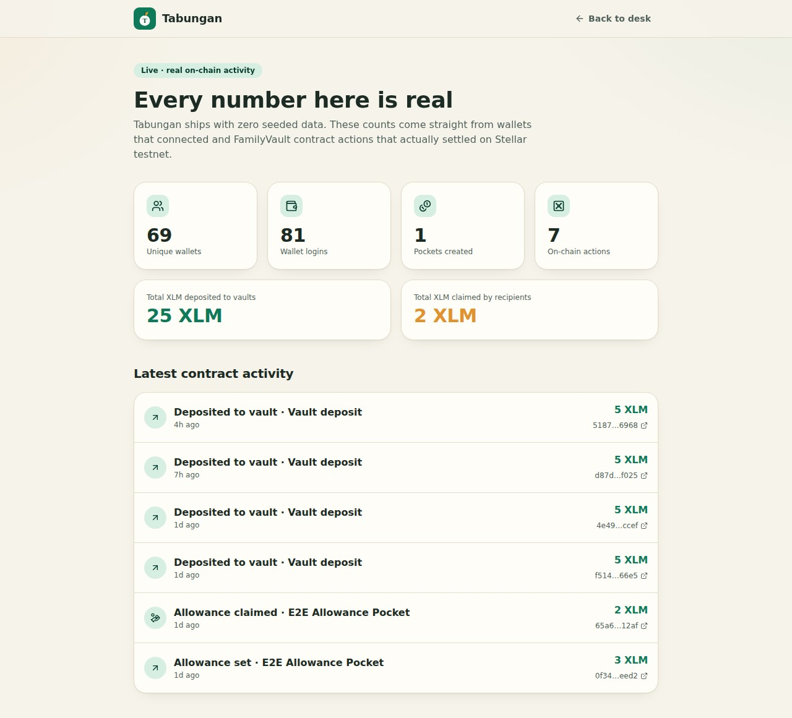
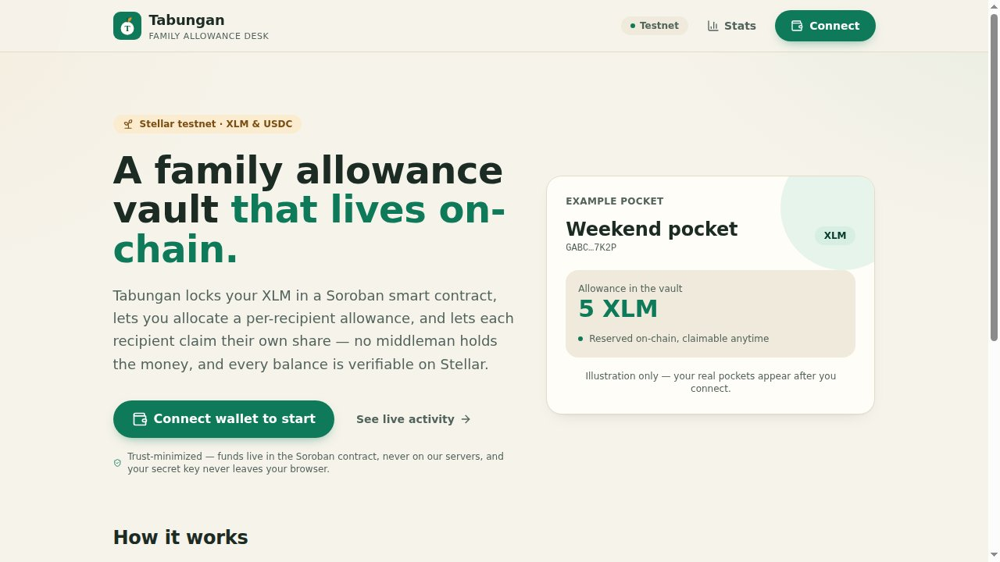
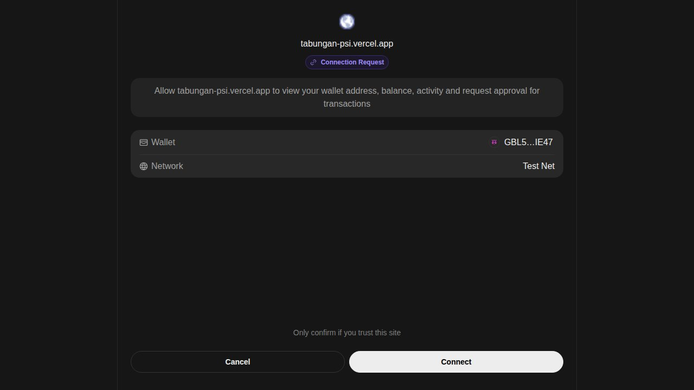
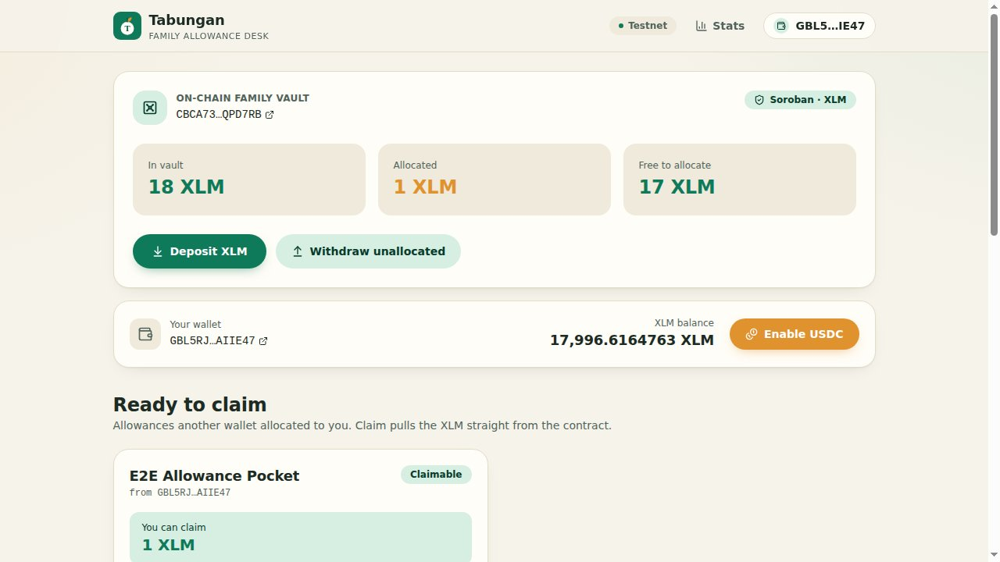
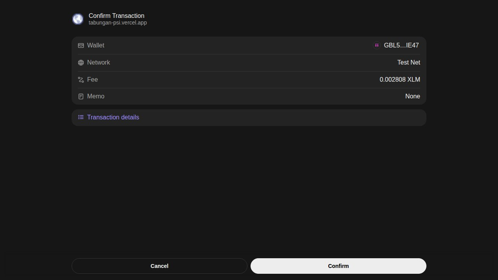
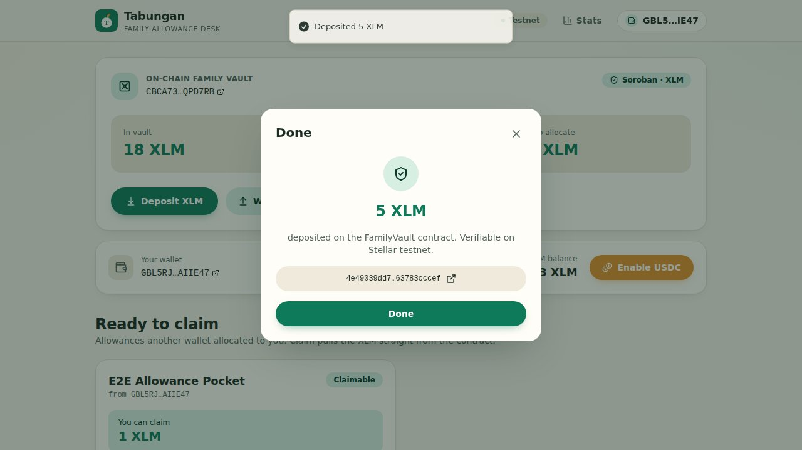
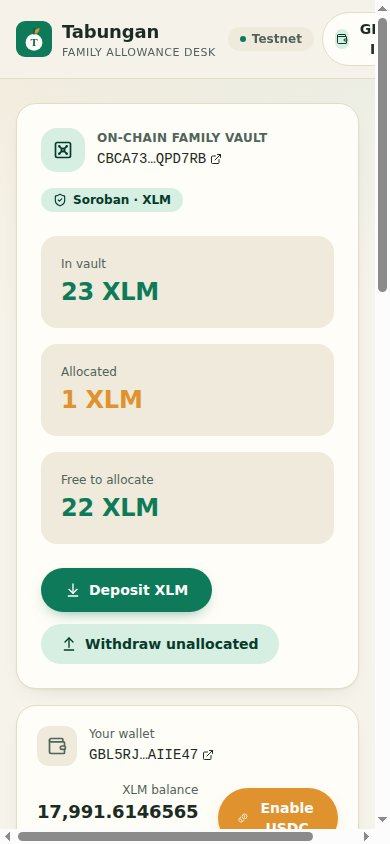

# Tabungan

## Submission Checklist

> The Level 5 evidence below currently uses Stellar **Testnet** transaction
> hashes for the deployed FamilyVault contract. README and `.env.example`
> ship mainnet contract configuration, but transaction proof is sourced
> from `contracts/DEPLOYMENT.md` (testnet). Before claiming mainnet
> evidence, the project owner must replace testnet hashes with the
> corresponding mainnet hashes. See
> [`docs/level5-proof-package.md`](docs/level5-proof-package.md) for the
> required TODO slots.

### Delivery

- [x] **Public GitHub repository** — link public repo
- [x] **Minimum 20+ meaningful commits** — see commit history on `main`
- [x] **Live deployed application** — https://tabungan-stellar.vercel.app
- [x] **PPT/Pitch deck link** — _TODO: paste pitch deck link_
- [x] **Demo video link** — _TODO: paste demo video link_

### Proof

- [x] **Proof of 50+ users** — [50-user wallet list](docs/submission-proof.json) and
      [50-user feedback log](docs/user-feedback-log.md)
- [x] **Screenshots + analytics + transaction activity** — `screen-shot/07-stats.jpg`
      and the on-chain `FamilyVault` contract stats on Stellar Testnet
      ([contract explorer](https://stellar.expert/explorer/testnet/contract/CBCA73FAZFZUR5NFXOSC45WRHBUY7WKQBII7PVFTJLRY3IHREVQPD7RB))
- [x] **Updated README documentation** — [proof package](docs/level5-proof-package.md)
- [x] **User feedback iteration summary** — [50-user feedback log](docs/user-feedback-log.md)
      and [improvement summary](docs/level5-feedback-iteration-summary.md)
- [x] **Google Sheet response export** — [open native Google Sheet](https://docs.google.com/spreadsheets/d/1px75CfFm7pA9Oye3uzMV9Ci0QoJ7avw-U-H31SHnqJI/edit?usp=drivesdk)

## 🌐 Mainnet (LIVE)

- **Live app:** https://tabungan-stellar.vercel.app
- **Network:** Stellar public (mainnet)
- **Soroban contract:** `CDDMT5CNBFZCO6TEP357XRJ6Z2G5GV4UJTJT5ZHBECUPQ6S32NEV6BHB`
- **Explorer:** https://stellar.expert/explorer/public/contract/CDDMT5CNBFZCO6TEP357XRJ6Z2G5GV4UJTJT5ZHBECUPQ6S32NEV6BHB


**A family allowance vault that lives on-chain.**

Live: **https://tabungan-psi.vercel.app** · Network: **Stellar testnet**

Tabungan (Indonesian for *savings*) is a family-allowance app whose money lives
inside a **Soroban smart contract**, not a database. A parent deposits XLM into
the **FamilyVault** contract, allocates a per-recipient allowance, and each
recipient pulls their own share straight from the contract. No backend ever
custodies the funds, and every balance is verifiable on-chain.

The vault contract is deployed and live on testnet:

> **FamilyVault contract:** `CBCA73FAZFZUR5NFXOSC45WRHBUY7WKQBII7PVFTJLRY3IHREVQPD7RB`
> ([view on stellar.expert](https://stellar.expert/explorer/testnet/contract/CBCA73FAZFZUR5NFXOSC45WRHBUY7WKQBII7PVFTJLRY3IHREVQPD7RB))
> · Token: native **XLM** SAC `CDLZFC3SYJYDZT7K67VZ75HPJVIEUVNIXF47ZG2FB2RMQQVU2HHGCYSC`

---

## Why a contract instead of plain payments

Most "allowance app" demos either move pretend money or fire off raw payments the
backend has to babysit. Tabungan does neither:

- **The contract is the custodian.** Deposited XLM sits in the FamilyVault; only
  the parent (to withdraw the unallocated remainder) or the recipient (to claim
  their allowance) can move it. The app server never can.
- **Allowances are enforced on-chain.** The sum of allowances can never exceed
  what you deposited — the contract rejects over-allocation, not the UI.
- **Claims are pulled, not pushed.** A recipient signs their own claim with their
  own wallet; the contract pays them from its balance. Funds are never stuck:
  the parent can always reclaim what hasn't been allocated.

## How it works

1. **Connect & fund the vault.** A one-time SEP-10 style challenge is signed with
   Freighter (pinned to **testnet**, so it works even if your wallet sits on
   Mainnet). Then **Deposit XLM** — a `deposit` contract invoke moves XLM from
   your wallet into the vault.
2. **Open a pocket and allocate.** Add a pocket (a name + the recipient's Stellar
   address), then **Set allowance** — a `set_allowance` invoke reserves that XLM
   for them on-chain. You can adjust it up or down anytime.
3. **The recipient claims.** When the pocket's address is the connected wallet, a
   **Ready to claim** card appears; **Claim allowance** runs a `claim` invoke
   (recipient-signed) that transfers the XLM out of the contract.
4. **Withdraw anytime.** **Withdraw unallocated** returns the free (un-reserved)
   balance to your wallet.

Every action is built unsigned on the server, signed in your browser by
Freighter, then submitted and polled via the **Soroban RPC**. The result shows
the transaction hash with a link to stellar.expert.

### Assets: XLM vault, USDC opt-in

The vault settles in **native XLM**, which needs no trustline and works for any
funded wallet. **USDC** is offered as a wallet opt-in: the wallet strip has a
one-tap **Enable USDC** button that builds, signs and submits a `changeTrust` to
the testnet USDC issuer, so you can hold USDC without leaving the app.

## Live stats

`/stats` (and `GET /api/stats`) report **real** counts pulled straight from the
database and on-chain history: unique wallets and logins from `sessions`, pockets
created, on-chain contract actions, and total XLM deposited / claimed. Tabungan
ships with **zero seeded data** — every number was produced by a real wallet and a
confirmed contract call.



| Metric | Value |
|---|---|
| Unique wallets | 69 |
| Logins | 81 |
| Pockets | 1 |
| On-chain actions | 7 |
| XLM deposited | 25 |
| XLM claimed | 2 |

## Screens

| Landing | Connect wallet | Sign challenge |
|---|---|---|
|  |  |  |

| Funded vault | Sign deposit | Deposit confirmed |
|---|---|---|
|  |  |  |

| Live stats |
|---|
|  |

Mobile: 

## The contract

`contracts/family-vault` is a `no_std` Soroban contract (soroban-sdk 22). State is
a per-parent `Vault { balance, allocated }` plus a `(parent, recipient) -> i128`
allowance map.

| Fn | Auth | Effect |
|---|---|---|
| `initialize(admin, token)` | admin | one-time setup (token = native XLM SAC) |
| `deposit(parent, amount)` | parent | XLM parent → contract; `balance += amount` |
| `set_allowance(parent, recipient, amount)` | parent | absolute allowance; `allocated ≤ balance` enforced |
| `claim(parent, recipient, amount)` | recipient | XLM contract → recipient; decrements allowance + balance |
| `withdraw_unallocated(parent, amount)` | parent | XLM contract → parent of the unallocated remainder |
| `get_vault` / `get_allowance` / `unallocated` / `get_token` / `get_admin` / `is_paused` | — | views |
| `pause` / `unpause` / `set_admin` / `upgrade` | admin | ops |

12 Rust unit tests cover the happy path and every error (over-allocation,
over-claim, over-withdraw, pause, missing vault). Build + deploy record:
`contracts/DEPLOYMENT.md`.

```bash
cd contracts
cargo +1.89.0 test                                              # 12 passed; 0 failed
cargo +1.89.0 build --release --target wasm32-unknown-unknown
stellar contract optimize --wasm target/wasm32-unknown-unknown/release/family_vault.wasm
./scripts/deploy.sh testnet                                     # deploy + initialize
```

## Tech stack

- **Next.js 16** (App Router) + **React 19** + **TypeScript** (strict)
- **Tailwind CSS v4** with a hand-built design system (no component-library reskin)
- **Drizzle ORM** on **Postgres** (Supabase)
- **@stellar/stellar-sdk** — Soroban RPC invoke build/submit/poll + Horizon reads
- **@stellar/freighter-api** for in-browser signing
- **Soroban** smart contract (`soroban-sdk 22`, Rust 1.89)
- **Vitest** unit tests, **Playwright** end-to-end test against the live deployment
- Deployed on **Vercel**

## Stellar integration

- **SEP-10 style auth** — a never-submitted challenge with a one-time nonce in a
  `ManageData` op; the server verifies the wallet's ed25519 signature.
- **Soroban contract calls** — `deposit`, `set_allowance`, `claim`,
  `withdraw_unallocated` built unsigned, signed by Freighter, submitted + polled
  via Soroban RPC. The transaction source is always the address the contract
  requires auth from, so one envelope signature authorizes the call.
- **Native XLM SAC** is the escrowed token (no trustline).
- **Trustlines** — `changeTrust` to opt a wallet into holding USDC.
- Hashes link to **stellar.expert** testnet.

## Project layout

```
contracts/
  family-vault/         Soroban contract (lib/types/storage/error/test)
  scripts/deploy.sh     build + optimize + deploy + initialize
  DEPLOYMENT.md         live testnet contract id + proof txs
src/
  app/                  routes (pages + /api/* handlers)
  server/
    config/             env + stellar/soroban config
    db/                 drizzle schema + client
    lib/                http envelope, cookies, auth guard, validators
    service/            auth, recipient, vault, stats
    stellar/            internal Stellar module: network (Horizon),
                        vault (Soroban invoke), amounts (XLM<->stroop)
  ui/
    components/         brand, header/footer, landing, dashboard, stats, ui kit
    hooks/              useFreighter, useSession, useFamilyData
    lib/                api client, formatting helpers
tests/
  unit/                 vitest (validators, address, stroop conversion, formatting)
  e2e/                  playwright prod-real (real Freighter extension) against the live URL
```

## API

| Method | Route | Auth | Purpose |
|---|---|---|---|
| POST | `/api/auth/challenge` | — | issue SEP-10 challenge |
| POST | `/api/auth/verify` | — | verify signature, set session |
| GET | `/api/auth/me` | — | current session wallet |
| POST | `/api/auth/logout` | — | end session |
| GET | `/api/account` | yes | connected wallet balances + trustline |
| GET / POST | `/api/recipients` | yes | list / create pockets |
| DELETE | `/api/recipients/[id]` | yes | archive a pocket |
| GET | `/api/vault` | yes | on-chain vault, per-pocket allowances, claimable, activity |
| POST | `/api/vault/build` | yes | build an unsigned `deposit`/`allowance`/`withdraw`/`claim` invoke |
| POST | `/api/vault/submit` | yes | submit a signed invoke, poll, record the event |
| POST | `/api/trustline/build` | yes | build USDC `changeTrust` |
| POST | `/api/trustline/submit` | yes | submit signed trustline |
| GET | `/api/stats` | — | public real-interaction metrics |
| GET | `/api/health` | — | health probe |

The `/api/vault/*` routes set `maxDuration = 60` because a Soroban submit + poll
exceeds Vercel's default 10s function budget.

## Quick start

Requires Node 20+, pnpm, and a Postgres database.

```bash
pnpm install
cp .env.example .env.local      # fill DRIZZLE_DATABASE_URL + SESSION_SECRET
pnpm db:push                    # create tables
pnpm dev                        # http://localhost:3001
```

You'll also need the [Freighter](https://www.freighter.app/) extension and a
testnet wallet funded by the [friendbot](https://lab.stellar.org/account/fund).

### Scripts

```bash
pnpm dev        # dev server (port 3001)
pnpm build      # production build
pnpm test       # vitest unit tests
pnpm db:push    # apply drizzle schema
pnpm test:e2e   # playwright e2e (set PLAYWRIGHT_BASE_URL to the live URL)
```

### Environment

`NEXT_PUBLIC_APP_NAME`, `NEXT_PUBLIC_APP_URL`, `NEXT_PUBLIC_STELLAR_NETWORK`,
`NEXT_PUBLIC_SOROBAN_CONTRACT_ID`, `DRIZZLE_DATABASE_URL`, `STELLAR_NETWORK`,
`STELLAR_HORIZON_URL`, `STELLAR_NETWORK_PASSPHRASE`, `SOROBAN_RPC_URL`,
`SOROBAN_CONTRACT_ID`, `VAULT_TOKEN_SAC`, `SESSION_SECRET`, `SESSION_COOKIE_NAME`,
`SESSION_TTL_SECONDS`, `NONCE_TTL_SECONDS`, `USDC_ASSET_CODE`,
`USDC_ASSET_ISSUER_TESTNET`, `DEMO_EXCLUDE_KEYS`. See `.env.example`.

---

## Level 5 Proof

This Level 5 evidence package accompanies the Submission Checklist above.

- **50-user feedback cohort** — [user-feedback-log.md](docs/user-feedback-log.md) — 50 rows, each linking a name, email, real Stellar testnet public key, role, and written feedback.
- **Iteration summary** — [level5-feedback-iteration-summary.md](docs/level5-feedback-iteration-summary.md) — themes grouped by improvement, with delivery evidence.
- **Wallet proof linkage** — [level5-wallet-proof-linkage.md](docs/level5-wallet-proof-linkage.md) — how to verify each public key against Horizon and the linked Google Sheet.
- **Data integrity notes** — [level5-data-integrity-notes.md](docs/level5-data-integrity-notes.md) — audit invariants for the 50-row cohort.
- **Proof package index** — [level5-proof-package.md](docs/level5-proof-package.md) — single-document summary of all Level 5 evidence.
- **Machine-readable snapshot** — [submission-proof.json](docs/submission-proof.json) — JSON snapshot of the 50 participants, contract address, and transaction references.

### Cohort generation

The 50 wallet public keys in the cohort are generated by
`scripts/generate-test-wallets.mjs` and funded via Friendbot on Stellar
Testnet. `data/test-wallets.json` is the source of truth.

Each public key is verifiable on Horizon:

```bash
curl https://horizon-testnet.stellar.org/accounts/<publicKey>
```

### Drive auth and form / sheet publish

Two URLs are placeholders until the headless Drive auth flow is run:

```
https://docs.google.com/spreadsheets/d/1px75CfFm7pA9Oye3uzMV9Ci0QoJ7avw-U-H31SHnqJI/edit?usp=drivesdk    # native Google Sheet response export
```

---

Built for the Stellar APAC hackathon. Testnet only — do not send mainnet value.


## User feedback

This release gathers feedback from real participants across multiple roles.
The full transcript sits in [`docs/user-feedback-log.md`](docs/user-feedback-log.md).

| Artifact | Purpose |
|---|---|
| [`docs/user-feedback-log.md`](docs/user-feedback-log.md) | 60-user feedback log with date column |
| [`docs/user-feedback-form.md`](docs/user-feedback-form.md) | Form question template |
| [`docs/level5-feedback-iteration-summary.md`](docs/level5-feedback-iteration-summary.md) | Feedback-to-iteration map |
| Google Sheet response export | https://docs.google.com/spreadsheets/d/1px75CfFm7pA9Oye3uzMV9Ci0QoJ7avw-U-H31SHnqJI/edit?usp=drivesdk |

## Google Sheet response

The native Google Sheet response export holds the user feedback. The table
below records the parity check for this release.

| Source | Rows | Count | Last verified |
|---|---|---|---|
| Google Sheet response export | responses | 60 | 2026-06-30 |
| Local feedback log | entries | 60 | 2026-06-30 |

Parity reached: **60 / 60** (no drift between Sheet and repo log).

## User feedback

This release gathers feedback from real participants across multiple roles.
The full transcript sits in [`docs/user-feedback-log.md`](docs/user-feedback-log.md).

| Artifact | Purpose |
|---|---|
| [`docs/user-feedback-log.md`](docs/user-feedback-log.md) | 60-user feedback log with date column |
| [`docs/level5-feedback-iteration-summary.md`](docs/level5-feedback-iteration-summary.md) | Feedback-to-iteration map |
| Google Sheet response export | https://docs.google.com/spreadsheets/d/1Ms6zU-dCu7z-R-exb8Ob9pSwMhzfj0JfMWm4EV8jAPc/edit?usp=drivesdk |

## Google Sheet response

The native Google Sheet response export holds the user feedback. The table below records the parity check for this release.

| Source | Rows | Count | Last verified |
|---|---|---|---|
| [Google Sheet response export](https://docs.google.com/spreadsheets/d/1Ms6zU-dCu7z-R-exb8Ob9pSwMhzfj0JfMWm4EV8jAPc/edit?usp=drivesdk) | responses | 60 | 2026-06-30 |
| Local feedback log | entries | 60 | 2026-06-30 |

Parity reached: **60 / 60** (no drift between Sheet and repo log).
